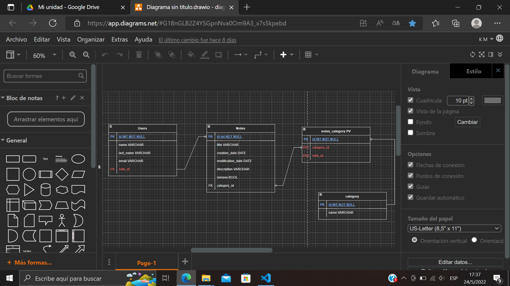

### Evaluación práctica DER y script
#### La idea de esta práctica es pensar en el diseño de una base de datos relacional, que me permita almacenar información sobre un sistema que administra notas de texto. Comenzando primero a diseñar el diagrama entidad-relación. Una vez completado el proceso de diseño, realicé el script cargando registros en cada tabla de la DB

